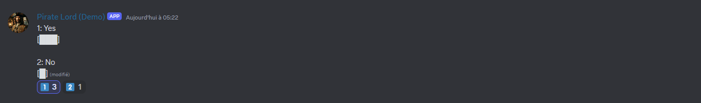
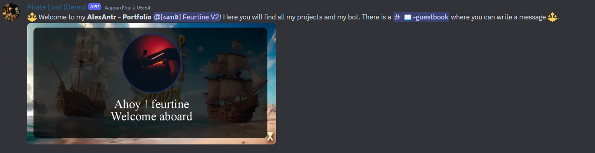

# PirateLord Bot

PirateLord is a Discord bot designed for my server (Sea of Thieves communities). It offers various functionalities such as music playback, role management, message reactions, and voice channel management.

## Table of Contents
- [Features](#features)
  - [Message Reactions](#message-reactions)
  - [Ascii Poll](#poll)
  - [Welcome Message](#welcome)
  - [Role Management](#role-management)
  - [Guild Events](#guild-events)
  - [Voice Channels](#voice-channels)
  - [Slash Commands](#slash-commands)
- [Dependencies](#dependencies)

# Features 
### Message Reactions 
The bot can handle message reactions for various purposes, including polls.

```js
const messagesReactions = require('./events/messages/messages-reactions');
const poll = require('./events/messages/poll');

// Detect all reactions on messages
messagesReactions(client);
poll(client);
```

### Poll
The bot can create an ascii poll to view the surveys :


### Welcome
When a member joins the server, a message appears with a banner (with nickname & avatar) and a welcome message


### Role Management
Manage roles easily with event handlers.

```js
const addRoles = require('./events/roles/add-roles');

// Roles Events
addRoles(client);
```

### Guild Events
Handle guild-specific events such as welcoming new members.
```js
const AddMember = require('./events/guilds/guild-member-add');

// Guilds Events
AddMember(client);
```

### Voice Channels
Automatically create voice channels for different ship types in Sea of Thieves.
```js
const createSloopChannels = require('./events/vocals/create-sloopchannels');
const createBrigChannels = require('./events/vocals/create-brigchannels');
const createGalleonChannels = require('./events/vocals/create-galleonchannels');

// Detect all vocal events
createSloopChannels(client);
createBrigChannels(client);
createGalleonChannels(client);
```

### Slash Commands
Handle slash commands efficiently.
```js
client.commands = new Collection();

const foldersPath = path.join(__dirname, 'commands');
const commandFolders = fs.readdirSync(foldersPath);

for (const folder of commandFolders) {
    const commandsPath = path.join(foldersPath, folder);
    const commandFiles = fs.readdirSync(commandsPath).filter(file => file.endsWith('.js'));
    for (const file of commandFiles) {
        const filePath = path.join(commandsPath, file);
        const command = require(filePath);
        if ('data' in command && 'execute' in command) {
            client.commands.set(command.data.name, command);
        } else {
            console.log(`[WARNING] The command at ${filePath} is missing a required "data" or "execute" property.`);
        }
    }
}

client.on(Events.InteractionCreate, async interaction => {
    if (!interaction.isChatInputCommand()) return;

    const command = interaction.client.commands.get(interaction.commandName);

    if (!command) {
        console.error(`No command matching ${interaction.commandName} was found.`);
        return;
    }

    try {
        await command.execute(interaction);
    } catch (error) {
        console.error(error);
        if (interaction.replied || interaction.deferred) {
            await interaction.followUp({ content: 'There was an error while executing this command!', ephemeral: true });
        } else {
            await interaction.reply({ content: 'There was an error while executing this command!', ephemeral: true });
        }
    }
});
```

### Dependencies
```json
{
  "@discordjs/opus": "^0.9.0",
  "@distube/spotify": "^1.5.1",
  "@distube/ytdl-core": "^4.13.3",
  "canvas": "^2.11.2",
  "discord.js": "^14.11.0",
  "distube": "^4.1.0",
  "dotenv": "^16.3.0",
  "ffmpeg-static": "^5.2.0",
  "formidable": "^3.5.1",
  "libsodium-wrappers": "^0.7.13",
  "mysql2": "^3.6.1",
  "yt-search": "^2.10.4",
  "ytdl-core": "^4.11.5"
}

```
